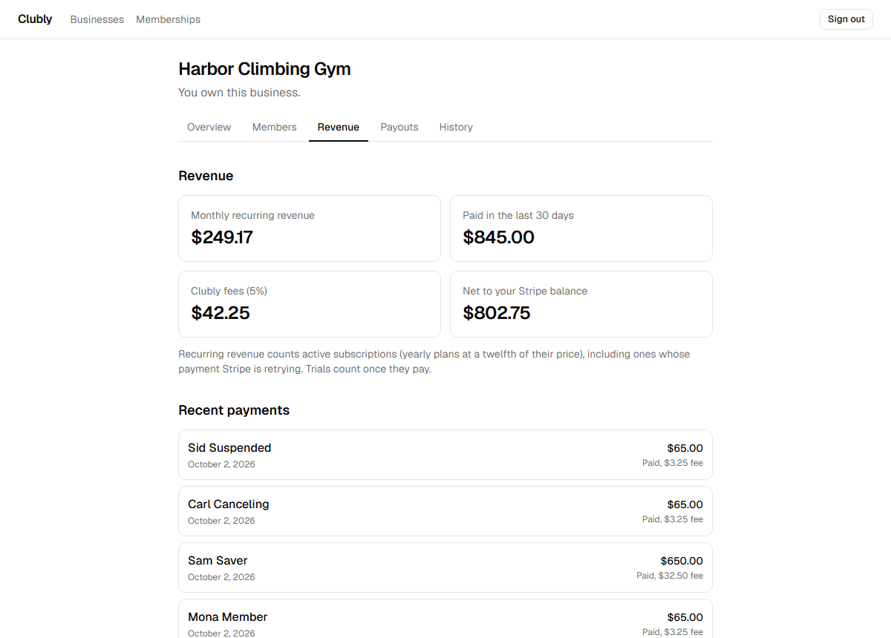
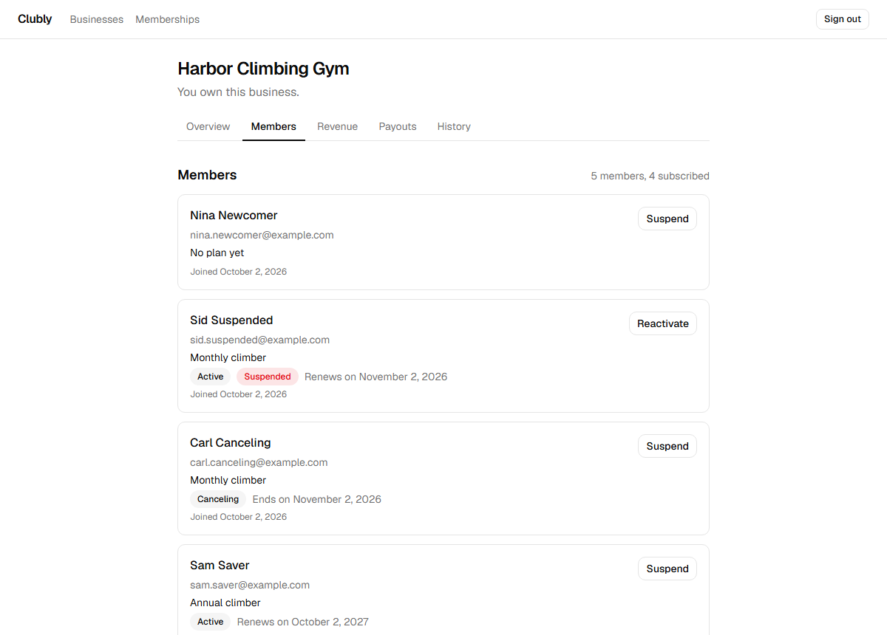
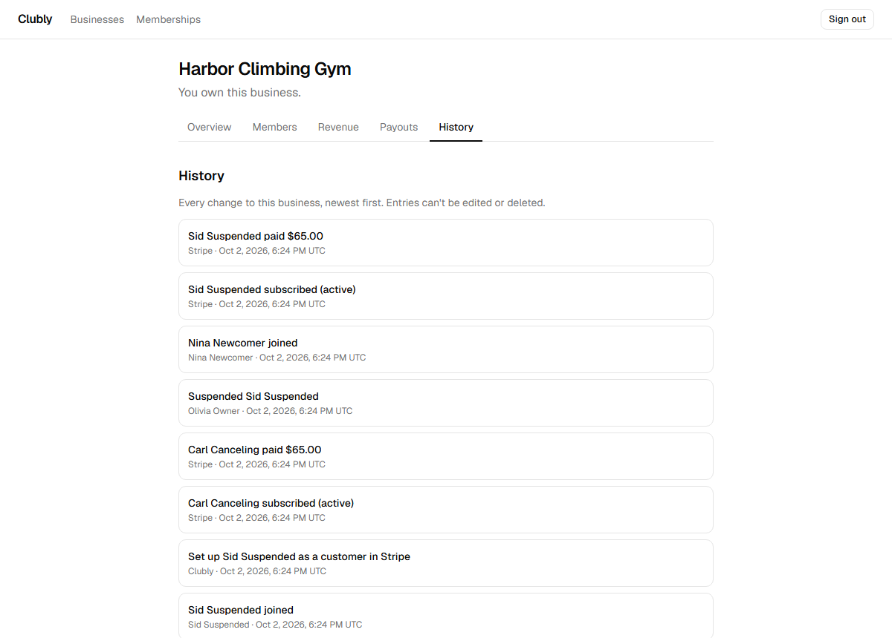
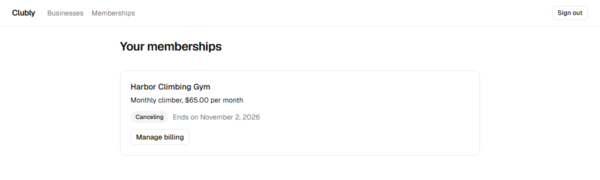
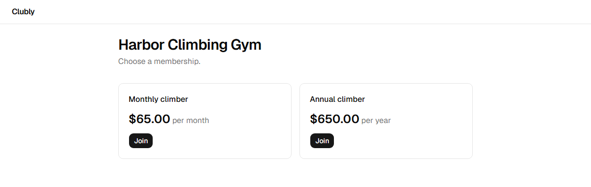
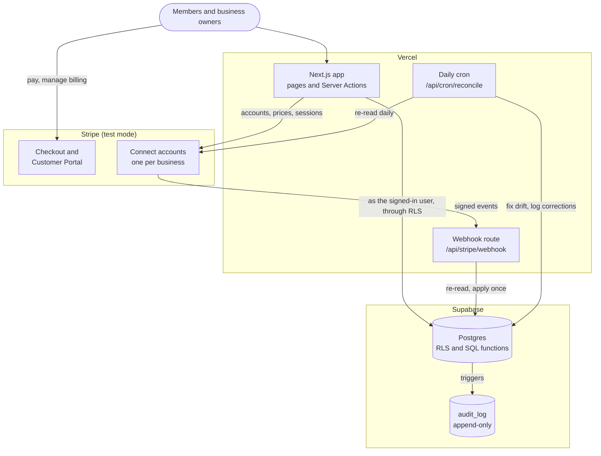
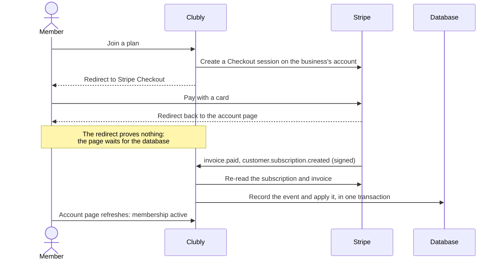

# Clubly

[](https://github.com/MostafaSaafan5517/clubly/actions/workflows/ci.yml)

A membership platform for small businesses: gyms, studios, clubs and coaching programs. A business connects its Stripe account and creates membership plans; members subscribe from the business's public page and manage their own billing. The platform takes a 5% fee on every payment.

Stripe runs in test mode only, so no real money moves. Pay with Stripe's test card `4242 4242 4242 4242`, any future date and any CVC.

## Live demo

**https://clubly-nine.vercel.app** (the demo gym's join page: [/b/harbor-climbing-gym](https://clubly-nine.vercel.app/b/harbor-climbing-gym))

Sign in with any of these demo accounts. The password for all of them is `climb-demo-2026`:

| Account                      | What you'll see                                         |
| ---------------------------- | ------------------------------------------------------- |
| `olivia.owner@example.com`   | The owner: revenue, members, payouts, history           |
| `adam.admin@example.com`     | An admin: everything except payouts                     |
| `sara.staff@example.com`     | Front-desk staff: members only, no revenue              |
| `carl.canceling@example.com` | A member whose membership ends at the period end        |
| `mona.member@example.com`    | A paying member, with a view-only Stripe billing portal |

The demo accounts are read-only, because everyone shares them: they can look at everything but change nothing, and the database itself refuses their writes. To try it all (create a business, add plans, join with the test card), sign up for your own account. The live demo sends no email (Supabase's free plan), so sign-ups are signed in at once, and the email-link sign-in and password reset emails are off there; locally they all work and are tested.

## What this project demonstrates

Production habits on a real multi-tenant billing product:

- **Tenant isolation in the database.** Postgres Row-Level Security keeps each business's data apart, with 250+ database tests (including ones that try to cross tenants) and a check of every business page against every kind of visitor.
- **Stripe as the source of truth.** Nothing activates because a browser came back from Checkout: memberships, cancellations and payments change only when Stripe's signed webhooks say so.
- **Webhooks that can't apply twice.** Each event is recorded and applied in one database transaction, so duplicates and out-of-order deliveries change nothing.
- **A daily reconciliation job** that re-reads Stripe and logs every correction it makes.
- **An append-only audit log** written by database triggers: no role, not even the server's, can edit or delete it.
- **Tests against the real Stripe sandbox:** a real Checkout payment, the billing portal, and a failed renewal on a Stripe test clock, with Stripe's own webhooks, locally and in CI.

## Screenshots

| Revenue (owner)                                    | Members (staff)                               |
| -------------------------------------------------- | --------------------------------------------- |
|  |  |

| History (owners and admins)                             | A member's account                                     |
| ------------------------------------------------------- | ------------------------------------------------------ |
|  |  |



## How it works



Every business gets its own Stripe Connect account. Members pay that account directly ([direct charges](https://docs.stripe.com/connect/direct-charges)), and the platform's fee is taken as an application fee on each payment.



## Design decisions

- **Deny by default, in two layers.** API roles get no privileges on new tables or functions until a migration grants them (per column where it matters), and RLS policies then decide which rows. Stripe ids are never granted to API roles at all; only server code with the service role reads them.
- **Policy helpers live in a private schema.** Policies that would query each other's tables (businesses and members) ask through `security definer` functions in a `private` schema that the API can't reach, which avoids infinite recursion and keeps the helpers off the HTTP surface.
- **Composite foreign keys** make it impossible for a subscription to join a member of one business to a plan of another.
- **Webhooks are nudges.** The handler ignores the event's payload and re-reads the object from Stripe, so a late or out-of-order event still writes the current state. A `stripe_events` table with the event id as its primary key makes each delivery idempotent, written in the same transaction as its effect.
- **Reconciliation is the safety net, not the main path.** It applies Stripe's view through the same SQL upserts the webhooks use, compares each row before and after, and logs the differences in the same transaction as the fixes.
- **The audit log is written by triggers, not application code,** so no code path can forget it. Stripe ids are named in it but never stored, because owners can read it.
- **Money is integer cents** everywhere, from parsing what an owner types to the revenue figures, which are added up in SQL that runs under the caller's RLS.
- **A 404, not a 403,** for anyone who isn't allowed to see a business page, so outsiders can't even tell it exists.
- **Read-only demo accounts, enforced in the database.** The demo's password is public, so its accounts are marked in their server-only app metadata, and triggers refuse their writes and any change to their email or password, even through the API directly.
- **Test mode is enforced in code:** the Stripe client refuses any key that isn't `sk_test_`.

Each of these is written down, with the reasoning, in [CLAUDE.md](CLAUDE.md), the project's working guide.

## Stack

- [Next.js](https://nextjs.org) 16 (App Router, Server Actions) and TypeScript in strict mode
- [Tailwind CSS](https://tailwindcss.com) and [shadcn/ui](https://ui.shadcn.com)
- [Supabase](https://supabase.com): Postgres, Auth, Row-Level Security, SQL migrations
- [Stripe](https://stripe.com): Connect, Checkout, Billing, Customer Portal, webhooks, test clocks
- [Vitest](https://vitest.dev), [Playwright](https://playwright.dev) and [pgTAP](https://pgtap.org) for tests
- GitHub Actions for CI, [Vercel](https://vercel.com) for hosting and the daily cron

## Project layout

```
src/app/            Pages and routes: public join page, auth, member account, business dashboard,
                    Stripe webhook, reconciliation cron
src/lib/            Helpers: money, dates, memberships, audit log wording, redaction
src/lib/stripe/     Server-only Stripe code: Connect, plans, Checkout, portal, payouts,
                    webhooks, reconciliation
supabase/migrations SQL migrations: tables, grants, RLS policies, triggers, functions
supabase/tests      pgTAP tests for privileges, RLS and every SQL function
e2e/                Playwright tests, including real Stripe sandbox flows
```

## Running locally

You need Node.js 24, [pnpm](https://pnpm.io) 11, [Docker Desktop](https://www.docker.com/products/docker-desktop/) (for the local Supabase stack), a [Stripe](https://stripe.com) account in test mode with Connect enabled, and the [Stripe CLI](https://docs.stripe.com/stripe-cli) (logged in with `stripe login`).

```bash
pnpm install
pnpm supabase start
pnpm env:local
pnpm env:stripe
pnpm dev
```

- `pnpm env:local` writes the local Supabase URL and keys into `.env.local`, plus a `CRON_SECRET` the first time.
- `pnpm env:stripe` writes the Stripe CLI's webhook signing secret there too.
- Add your Stripe test secret key yourself as `STRIPE_SECRET_KEY` (see `.env.example` for every variable).

In a second terminal, `pnpm stripe:listen` forwards Stripe's webhooks to the app. Then open http://localhost:3000.

### Demo data

With the app and `pnpm stripe:listen` running, `pnpm seed:demo` fills it with a climbing gym: an owner, staff, plans, and members who have paid with Stripe's test card. Sign in as `olivia.owner@example.com` (or any demo member it lists) with the password `climb-demo-2026`. It's safe to run again.

The daily reconciliation job runs on Vercel Cron in production. To run it locally, call it with the `CRON_SECRET` value from `.env.local`:

```bash
curl -H "Authorization: Bearer <CRON_SECRET>" http://localhost:3000/api/cron/reconcile
```

## Tests

| Suite          | Command           | Notes                                                                                                                                                                                             |
| -------------- | ----------------- | ------------------------------------------------------------------------------------------------------------------------------------------------------------------------------------------------- |
| Unit           | `pnpm test`       | Vitest                                                                                                                                                                                            |
| Database / RLS | `pnpm test:db`    | pgTAP; needs `pnpm supabase start` first                                                                                                                                                          |
| End-to-end     | `pnpm test:e2e`   | Playwright, with real Stripe sandbox webhooks; needs local Supabase running, `pnpm env:local`, the Stripe CLI logged in and `pnpm env:stripe`; first run: `pnpm exec playwright install chromium` |
| Smoke          | `pnpm test:smoke` | Read-only checks of a deployed, demo-seeded app: `E2E_BASE_URL=https://... pnpm test:smoke`                                                                                                       |

`pnpm lint`, `pnpm typecheck` and `pnpm format:check` run in CI alongside all three suites.

## Roadmap

- [x] **Phase 0:** project setup, test tooling and CI
- [x] **Phase 1:** authentication, businesses and Row-Level Security
- [x] **Phase 2:** Stripe Connect onboarding and membership plans
- [x] **Phase 3:** member subscriptions and webhooks
- [x] **Phase 4:** reconciliation job and audit log
- [x] **Phase 5:** business and member dashboards
- [x] **Phase 6:** end-to-end test flows
- [x] **Phase 7:** documentation, demo data and live demo
