# Design results: Clubly after the redesign

Step 7 of the UI redesign: what changed, measured against the [audit](audit.md)'s baseline on the same machine, with the same data and the same commands. The design itself is in [DESIGN.md](DESIGN.md).

**The screens.**

- [`before/index.md`](before/index.md): every screen and state before any change (the audit's set).
- [`after/index.md`](after/index.md): the same screens after the redesign, in light mode.
- [`after/dark/index.md`](after/dark/index.md): the same again in dark mode.

Each set has every screen at desktop (1440 wide) and mobile (390 wide), full page, with axe's findings for each in `axe-desktop.json` and `axe-mobile.json` beside the images. File names match across the sets, so `before/dash-04-revenue-desktop.jpg` and `after/dash-04-revenue-desktop.jpg` are the same screen. The after sets were captured on 2026-10-10 from the production build, against the local database, with the audit's fixtures:

```bash
pnpm build
SCREENS_DIR=docs/design/after pnpm screens
SCREENS_DIR=docs/design/after/dark SCREENS_COLOR_SCHEME=dark pnpm screens
SCREENS_DIR=docs/design/after LIGHTHOUSE=1 pnpm screens scripts/screens/lighthouse.spec.ts --project=desktop
```

## In short

The interface has an identity of its own, in light and dark, and the flows, behavior and existing wording are unchanged. The audit's three axe failures are fixed (all 74 screens pass axe at both sizes in light and dark, against 11 failing before), the nine pages without a heading have one, focus is a 2px outline at 11:1 or more, and the end-to-end suite now checks the states the audit found it missed.

On Lighthouse, every page scores 100 for accessibility, best practices and SEO, and 100 for performance on desktop. On the simulated slow phone the public pages and the member's account are faster than before. The business dashboards carry more on first paint than the old cards did: members still comes out ahead of where it started, and revenue is a few points lower, the one result below the baseline (below).

## What was measured, and how

| What                       | How                                                                                                                                                                                                  | When                                         |
| -------------------------- | ---------------------------------------------------------------------------------------------------------------------------------------------------------------------------------------------------- | -------------------------------------------- |
| Unit tests                 | Vitest (`pnpm test`), including the token tests: both dark copies match, the export is current, every color is in sRGB, and 34 color pairs per mode meet WCAG AA                                     | Every step that changed the app              |
| Database and RLS           | pgTAP (`pnpm test:db`)                                                                                                                                                                               | Every step that changed the app              |
| End to end                 | Playwright (`pnpm test:e2e`) on the production build, with Stripe's real sandbox webhooks: a real Checkout payment with the 4242 test card, the billing portal, and a failed renewal on a test clock | Every step that changed the app              |
| Accessibility in the suite | `e2e/accessibility.spec.ts`: axe (WCAG 2.1 A and AA) on every page as a visitor, an owner, staff and a member                                                                                        | Every step that changed the app              |
| Accessibility per screen   | `pnpm screens`: axe on every screen and state, at desktop and phone width, in light and dark                                                                                                         | Every step from the tokens on                |
| Lighthouse                 | `LIGHTHOUSE=1 pnpm screens`: six pages, mobile and desktop, median of three runs, on the local production build; `LIGHTHOUSE_SITE` for the live demo's signed-out pages                              | After each step that changed pages, and here |
| A/B                        | Two builds side by side, alternating runs (below)                                                                                                                                                    | When a step's numbers were close or odd      |

## Tests

Counts as each step's commit reported them.

| Step                   | Commit      | Unit | pgTAP | Playwright                         |
| ---------------------- | ----------- | ---- | ----- | ---------------------------------- |
| 3, tokens              | 34dc0ee     | 163  | 304   | 73                                 |
| 4, public pages        | c2d2dd6     | 166  | 304   | 73                                 |
| 5, sign-in pages       | c147086     | 166  | 304   | 73                                 |
| 6, dashboards          | 18b4f08     | 169  | 304   | every test passing, no retries     |
| 7, icons and 404 pages | this commit | 169  | 304   | 76, every test passing, no retries |

What changed in the tests, and why:

- **Tokens (step 3):** new unit tests for the tokens and for `cn`'s merge tables. Each was broken once to see it fail.
- **Public pages (step 4):** unit tests for `subscriptionTone`. No end-to-end test changed: the plan names, prices, refusals and status words read exactly as before.
- **Sign-in pages (step 5):** 11 checks in the auth, password and team specs now find the page title as a heading by role and level, with the same text. Once the title became a real `h1`, Next.js's route announcer copied it during client navigation, so a plain text match found it twice.
- **Dashboards (step 6):** unit tests for the initials helper. The accessibility test gained the states the audit found it missed: staff pages, archived and unfinished plans, a suspended member, paid and failed payments, a business without payments, and the empty business list. No selector or accessible name changed.
- **Icons and 404 pages (step 7):** `e2e/not-found.spec.ts` checks that an unknown address answers 404 with its title and a link home, and that a signed-in 404 keeps the header and reads exactly the same, title included, for a business the user can't see as for one that doesn't exist. The accessibility test runs axe on both 404 pages and checks reduced motion: buttons transition only when motion is welcome, and don't move when pressed under reduced motion.

## Accessibility

### axe on every screen

| Run         | Screens before | Failing before | Screens after | Failing after |
| ----------- | -------------- | -------------- | ------------- | ------------- |
| Light, 1440 | 74             | 11             | 74            | 0             |
| Light, 390  | 74             | 11             | 74            | 0             |
| Dark, 1440  | no dark mode   |                | 74            | 0             |
| Dark, 390   | no dark mode   |                | 74            | 0             |

### The audit's findings

The three failures axe found:

| Finding                                                                  | Before | After                                                                                                                                                              |
| ------------------------------------------------------------------------ | ------ | ------------------------------------------------------------------------------------------------------------------------------------------------------------------ |
| Gray badges: "Archived", "Not ready", "Payments not set up" (WCAG 1.4.3) | 4.3:1  | Fixed in step 3. Archived and Not ready are neutral badges whose pair the token tests hold to AA; Payments not set up is a warning badge (5.8:1 light, 8.0:1 dark) |
| "Suspended" badge (1.4.3)                                                | 4.0:1  | Fixed in step 3: 5.2:1 light, 5.1:1 dark                                                                                                                           |
| Failed-payments warning inside revenue's `<dl>` (1.3.1)                  | Fails  | Fixed in step 6: a danger notice after the figures                                                                                                                 |

And what axe doesn't catch:

| Finding               | Before                                                                                                                     | After                                                                                                                    |
| --------------------- | -------------------------------------------------------------------------------------------------------------------------- | ------------------------------------------------------------------------------------------------------------------------ |
| Pages with no heading | 9: sign-in, sign-up, check your email, email-link sign-in, password reset, new business, new plan, invite, change password | Each has an `h1` (steps 5 and 6)                                                                                         |
| Focus indicator       | Half-strength gray ring, 1.5:1                                                                                             | 2px outline, 11:1 or more (computed in DESIGN.md), appearing at once                                                     |
| Targets on phones     | Buttons and fields 32px, Sign out 28px, tabs about 38px                                                                    | Buttons and fields 40px; a page's main action and the tabs 44px; small buttons such as Sign out 32px                     |
| Skip link             | None                                                                                                                       | "Skip to content" first on every signed-in page                                                                          |
| Selects on iOS        | 14px text, zoomed on tap                                                                                                   | 16px on phones                                                                                                           |
| Reduced motion        | No rule: buttons moved when pressed and the payouts placeholder pulsed                                                     | A global rule stops animations and transitions, delays included; the press and the pulse only run when motion is welcome |

Automated checks find roughly a third of accessibility problems. Keyboard flow and what a screen reader announces still need a person.

## Lighthouse

Lighthouse 13.5.0, the version pinned in `scripts/screens/lighthouse.spec.ts` and used by the audit, at its mobile and desktop settings. Each page is measured three times and the median kept. The same six pages as the audit, on the local production build with the same demo data: the demo owner for members and revenue, the demo member for the account.

### Why single runs aren't trusted here

Lighthouse's mobile score simulates a slow phone from this machine's own speed. Anything else the machine is doing shows up as Total Blocking Time, and the score moves with it. In step 6 a single mobile run of the revenue page gave 89; five alternating A/B runs of the same build gave a median of 96. Even a median of three can come out low as a whole when the machine was busy.

So when a result was close or surprising, the two builds were measured A/B:

1. The earlier commit is checked out in a git worktree on the same drive (a junction to another drive breaks Turbopack), its dependencies installed offline from the lockfile, and built for production.
2. Both builds are served side by side with `next start` on two ports, against the same local database.
3. Each round measures the pages on both builds, alternating which build goes first.
4. Five rounds at the mobile setting; the medians are compared.

A difference is reported only when the medians show it.

### Local production build, mobile (before / after)

| Page                          | Performance | Accessibility | LCP           | TBT             |
| ----------------------------- | ----------- | ------------- | ------------- | --------------- |
| Home `/`                      | 95 / 96     | 100 / 100     | 2.5 s / 2.4 s | 158 ms / 156 ms |
| Join `/b/harbor-climbing-gym` | 90 / 95     | 100 / 100     | 2.7 s / 2.4 s | 318 ms / 187 ms |
| Sign-in `/login`              | 89 / 92     | 100 / 100     | 3.1 s / 2.8 s | 206 ms / 204 ms |
| Members (owner)               | 83 / 94     | 96 / 100      | 3.4 s / 2.8 s | 286 ms / 173 ms |
| Revenue (owner)               | 96 / 89     | 100 / 100     | 2.7 s / 3.0 s | 90 ms / 241 ms  |
| Account (member)              | 91 / 97     | 100 / 100     | 2.9 s / 2.5 s | 206 ms / 121 ms |

### Local production build, desktop (before / after)

| Page             | Performance | Accessibility |
| ---------------- | ----------- | ------------- |
| Home             | 100 / 100   | 100 / 100     |
| Join             | 99 / 100    | 100 / 100     |
| Sign-in          | 100 / 100   | 100 / 100     |
| Members (owner)  | 100 / 100   | 96 / 100      |
| Revenue (owner)  | 100 / 100   | 100 / 100     |
| Account (member) | 100 / 100   | 100 / 100     |

Best practices and SEO were 100 on every page, mobile and desktop, before; after: 100 on every page, mobile and desktop. Layout shift (CLS) was 0 everywhere before; after: 0 everywhere.

Members scored 96 for accessibility before because of the "Suspended" badge's contrast: Lighthouse runs axe too.

### Against the build before the redesign, A/B (mobile)

The tables above are one median of three runs per page. To check them, the commit before the redesign (`main`) and step 7 were measured A/B, five alternating rounds each, on sign-in and the signed-in pages (all four signed in as the demo owner):

| Page            | Before (`main`), median | Step 7, median | Median TBT    | Every step 7 run   |
| --------------- | ----------------------- | -------------- | ------------- | ------------------ |
| Sign-in         | 94                      | 97             | 174 to 108 ms | 97, 97, 97, 97, 97 |
| Members (owner) | 90                      | 92             | 179 to 227 ms | 92, 93, 83, 95, 74 |
| Revenue (owner) | 94                      | 89             | 146 to 272 ms | 89, 94, 87, 71, 93 |
| Account (owner) | 92                      | 90             | 223 to 267 ms | 93, 95, 90, 84, 84 |

Sign-in is clearly faster. Account's runs overlap the baseline's, so that difference is noise. Members comes out ahead, with a faster largest paint (3.3 s to 2.8 s). Revenue is lower in both measurements, the median of three above and this A/B, so it is reported as a regression rather than explained away. (An earlier A/B, step 5 against step 6, had put revenue level at 96 and 96: the machine's state moves these numbers by several points between sessions.)

### Along the way

Mobile performance as each step's commit reported it. The methods differ (against the audit's baseline, or A/B against the step before), so read each row on its own.

| Step             | Commit  | Reported                                                                                                                                                                   |
| ---------------- | ------- | -------------------------------------------------------------------------------------------------------------------------------------------------------------------------- |
| 3, tokens        | 34dc0ee | Against the baseline: members 83 to 96 (accessibility 96 to 100), sign-in 89 to 96, join 90 to 94; no page lower                                                           |
| 4, public pages  | c2d2dd6 | A/B against step 3, median of 5: sign-in 92 to 95, members 94 to 96, revenue 94 to 95. Against the baseline: home 95 to 97, join 90 to 97, account 91 to 97                |
| 5, sign-in pages | c147086 | Against the baseline: sign-in 89 to 97, members 83 to 96, join 90 to 94, account 91 to 97; desktop 100 throughout                                                          |
| 6, dashboards    | 18b4f08 | Home 98, join 95, sign-in 97, account 97; revenue 96 (A/B median of 5; a single run gave 89); members 84 (A/B median 88, against 96 for step 5); desktop 100 on every page |

Join reads 97 after step 4 and 94 after step 5, and step 5 didn't set out to change the join page: differences of that size are treated as noise unless an A/B run confirms them. Step 7's numbers are the "after" columns above.

### The business pages: the trade-off

Step 6 gave the business pages the ink band with the business's name and icon tabs, turned the members list into columns (initials, name, email and join date, the plan, a status badge with an icon and what happens next, the action), and made revenue lead with its figure at the largest size. On Lighthouse's simulated slow phone that is more work before the first paint than the old cards: the page's HTML is larger (the members page went from 32 KB to 50 KB uncompressed) and has more to style and lay out. The extra work shows mostly as blocking time: members paints its largest element sooner than before (3.4 s to 2.8 s), and revenue a little later (2.7 s to 3.0 s in the final run).

Tracing it found no single cause to remove. Taking the badge icons out, as an experiment, didn't change the first render's cost, and the stylesheet wasn't it either (each build's HTML styled the same with the other build's CSS). The one lever that worked was the type scale (next section).

It was accepted. Members ends above where it started (83 before the redesign, 94 in the final run, 90 to 92 A/B). Revenue is a few points lower on the simulated slow phone (96 to 89 in the final run, 94 to 89 A/B) and 100 on desktop, and the dashboards are what owners and staff use, mostly at a desk.

### What the type scale had to do with it

One finding from step 6 is worth writing down. On this machine, every distinct combination of font size, weight and letter-spacing on a page costs the browser work twice during first paint: once when it first lays out the text, and again when the web font arrives and replaces the fallback. On a desktop it's invisible; on the simulated slow phone it shows in the score.

Step 6 put every piece of text on the type scale: the page defaults to Body (15/23) instead of the browser's 16px, buttons set their labels in Body at 600 instead of 14px at 650, initials use Label, and so on. On the members page that cut the distinct combinations from 11 to 8. Measured A/B, it brought the revenue page's mobile score back level with step 5. So a strict type scale is a performance decision here as well as a visual one.

### The live demo, signed-out pages

Lighthouse never signs in to the live site, so only the home, join and sign-in pages are measured there. Before is `before/lighthouse-site.json` (2026-10-09). The redesign reaches the live demo when it's merged, so its after numbers are measured then, with the same command (`LIGHTHOUSE_SITE=https://clubly-nine.vercel.app`), and added here.

| Page    | Mobile performance | Desktop performance | Mobile LCP | Mobile TBT |
| ------- | ------------------ | ------------------- | ---------- | ---------- |
| Home    | 96                 | 100                 | 1.6 s      | 220 ms     |
| Join    | 94                 | 100                 | 1.8 s      | 232 ms     |
| Sign-in | 95                 | 100                 | 1.7 s      | 229 ms     |

Accessibility, best practices and SEO were 100 on all three, mobile and desktop.

The live demo scores higher on mobile than the local build because it sits behind Vercel's CDN, while the local mobile score simulates a slow phone from this machine. That's why the redesign is compared local against local.

## Before and after

| Screen        | Before                                                                                              | After                                                                                             |
| ------------- | --------------------------------------------------------------------------------------------------- | ------------------------------------------------------------------------------------------------- |
| Home          | 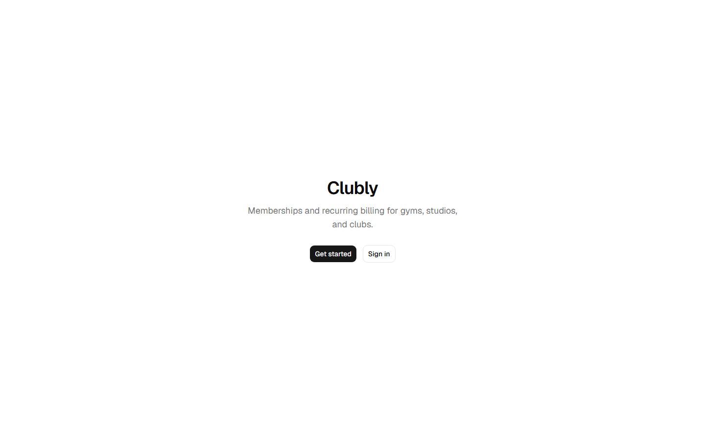                   | 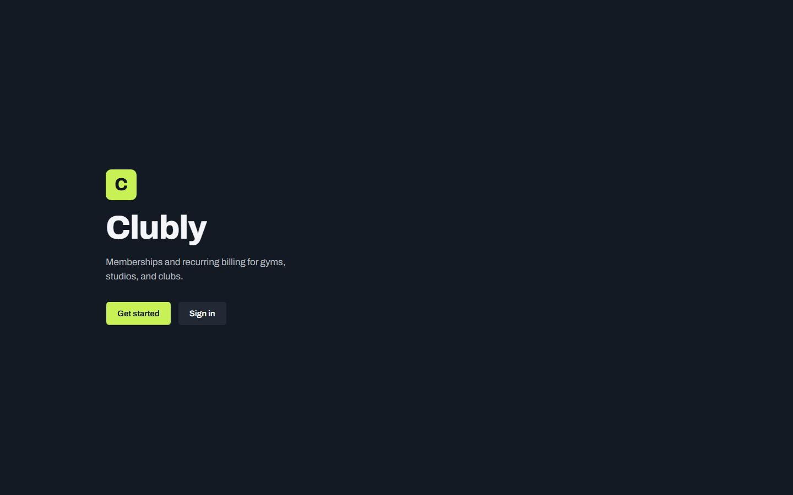                   |
| Join page     | 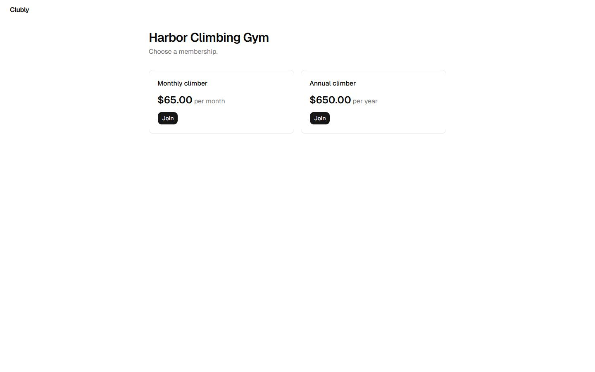                   | 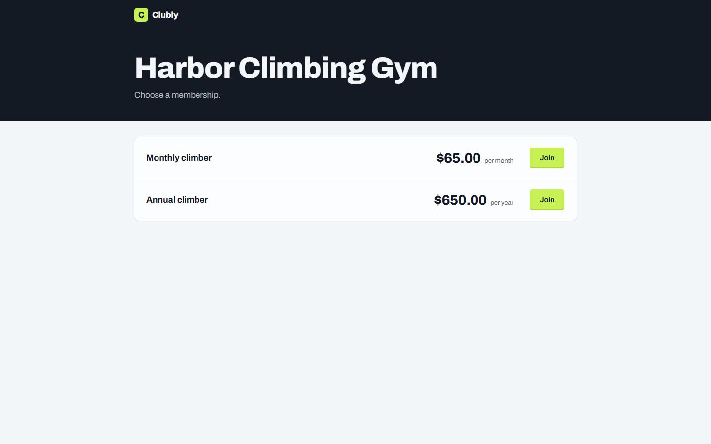                   |
| Sign-in       | 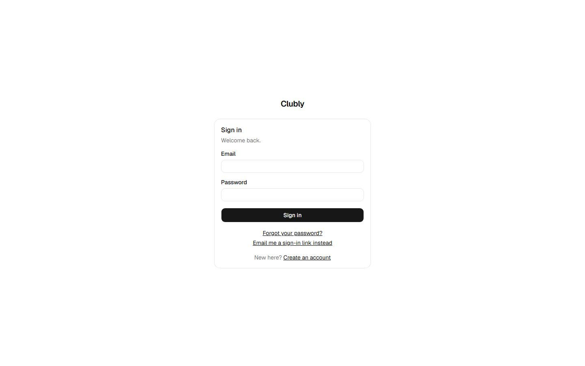                      | 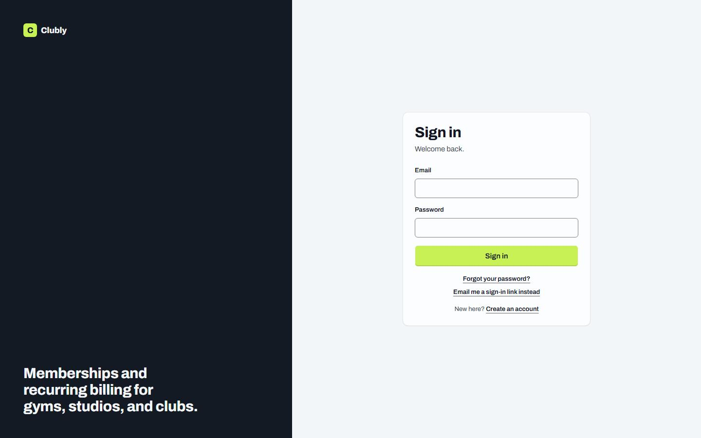                      |
| Revenue       | 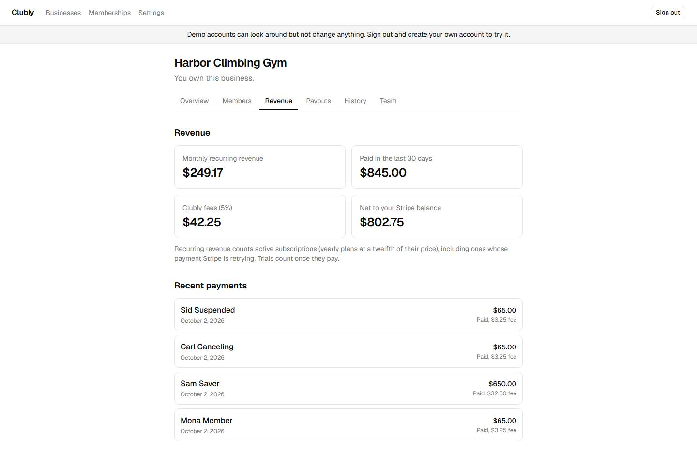                    | 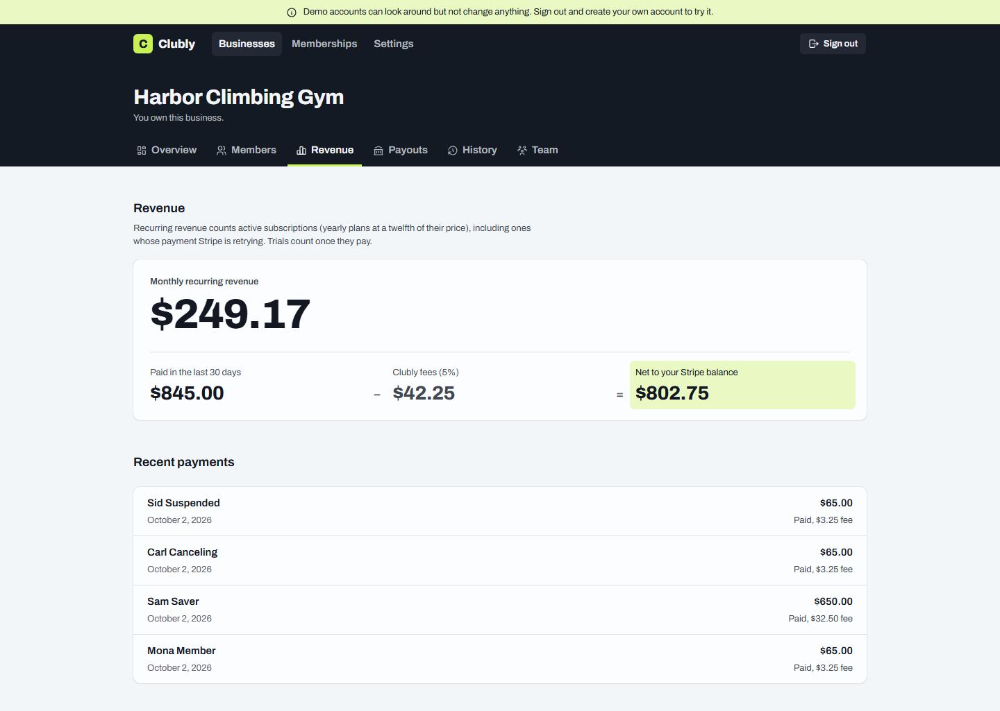                    |
| Members       | 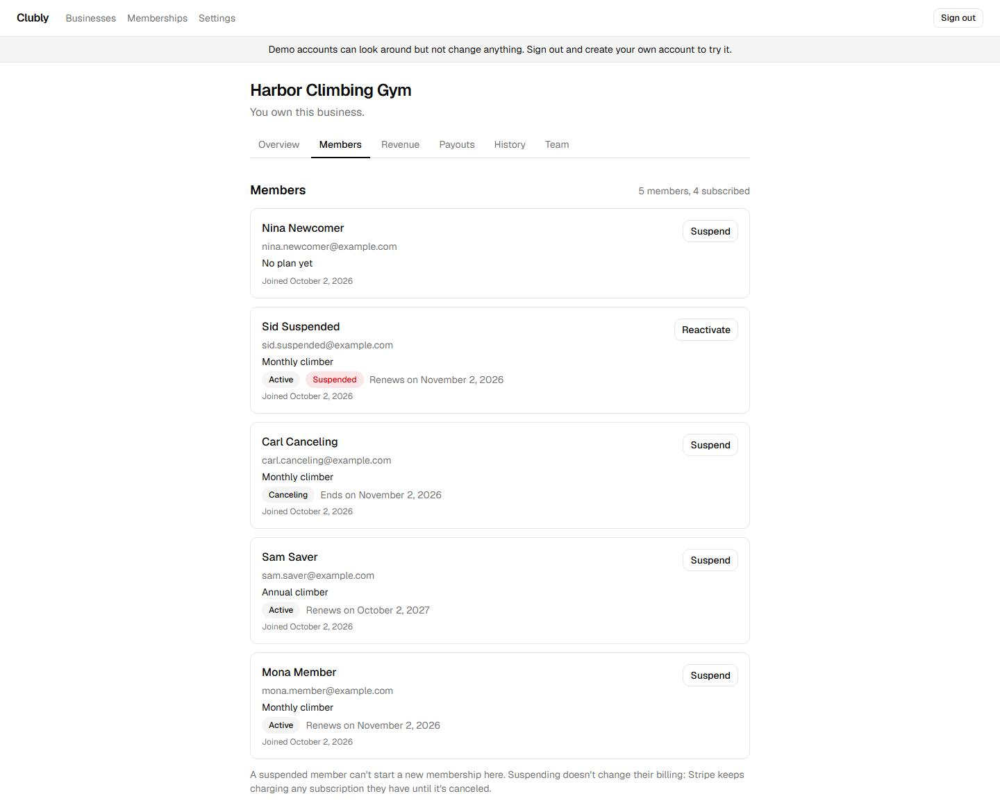                    | 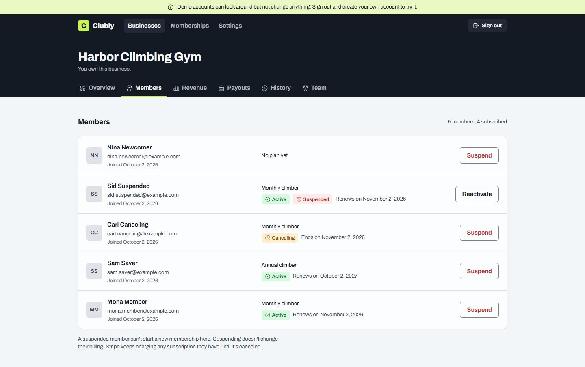                    |
| History       | 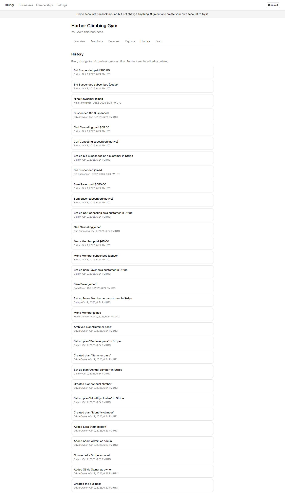                    | 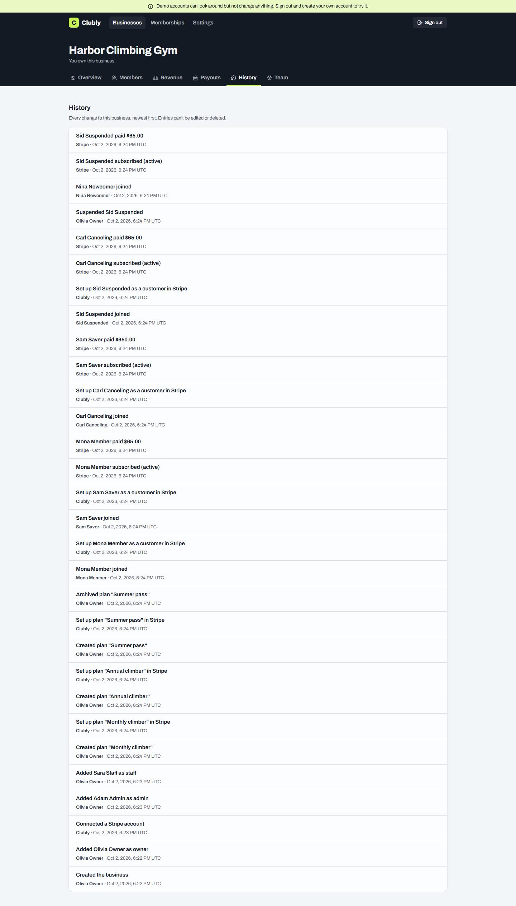                    |
| 404           | 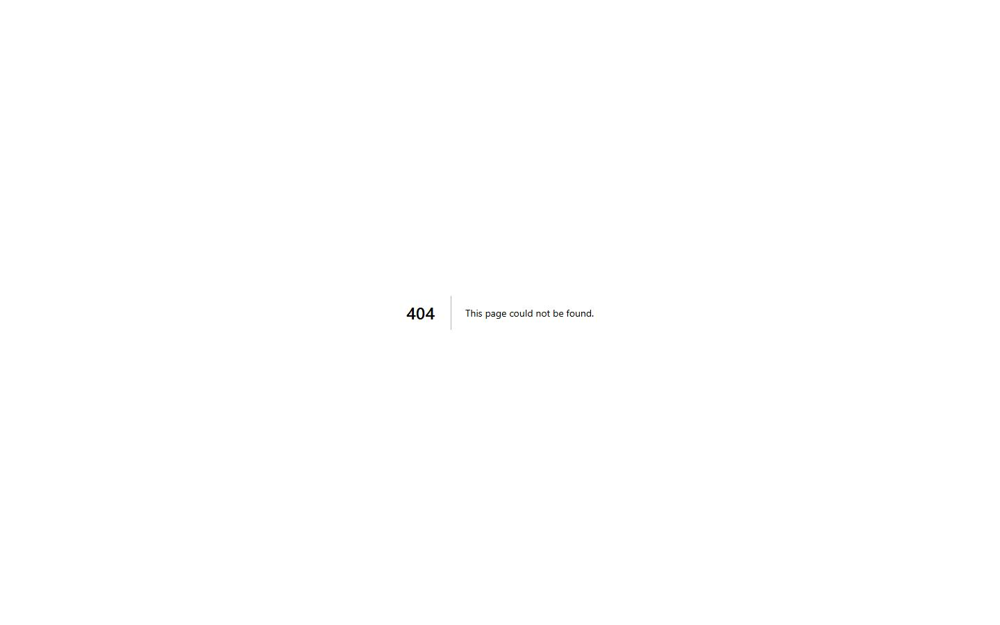               |                |
| Signed-in 404 | 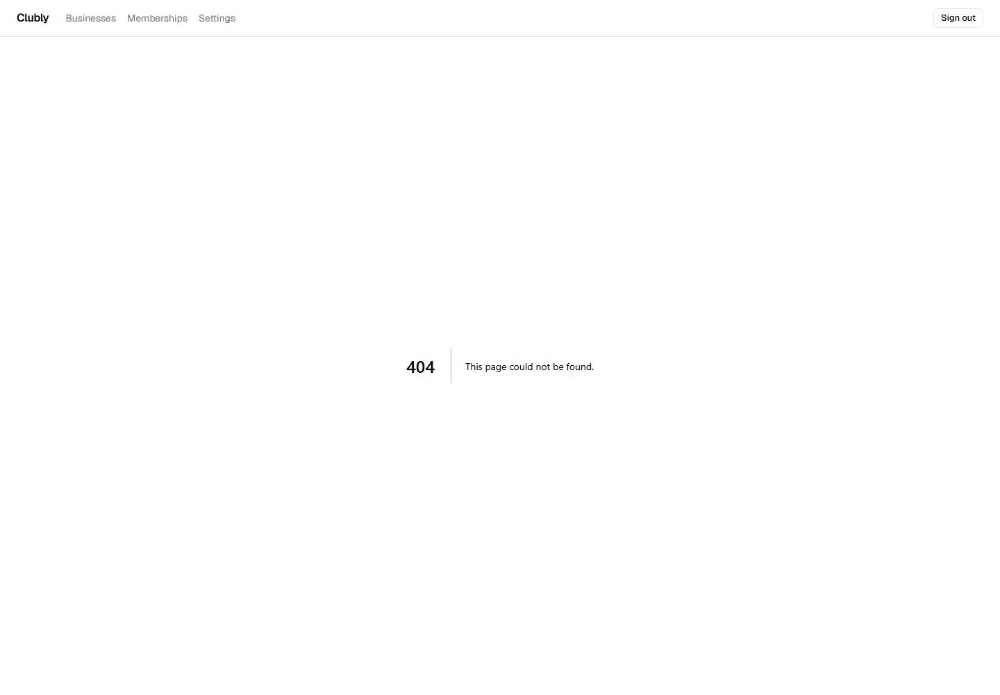 | 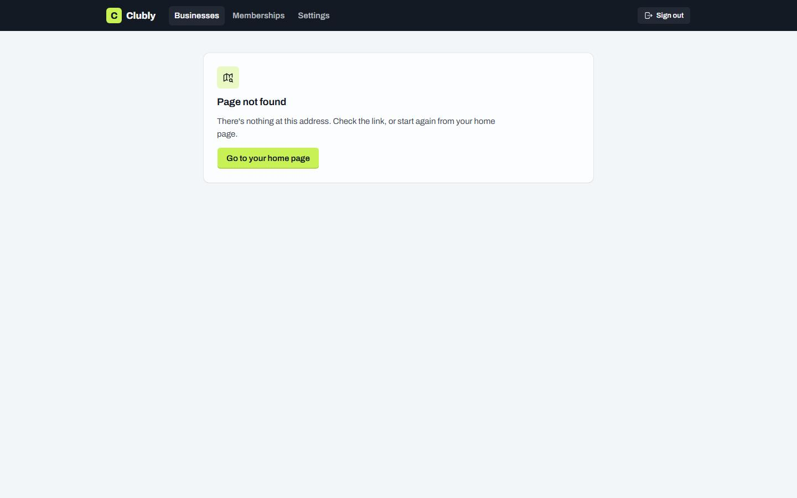 |

## What didn't change

- **Behavior and flows.** Every page does what it did. Stripe stays the source of truth, and the access checks and RLS are untouched.
- **The words.** Existing sentences kept their wording (the end-to-end tests read many of them). The 404 pages' text is new.
- **What the tests rely on.** Roles, labels, button and link text, one list item per row, regions named by their headings, figures as `dt`/`dd` pairs.

## Still open

- **The audit's proposals** (a home page that explains Clubly, an overview with numbers, the business's own logo and description, Stripe branding, confirming destructive actions, a refunded state, finding a member, a copy button for the join link) were never part of the redesign, and none was built.
- **"Refunded"** has its color and icon, but nothing in the app shows it yet.
- **Revenue on mobile** is a few points below where it started on the simulated slow phone (above). Members is above it.
- **The live demo's after numbers** are measured once the redesign is merged and deployed.
- **Not captured:** Stripe's hosted pages (not ours to restyle), pending button labels, and the payouts placeholder, which shows only while Stripe answers and locally is too quick to catch.
